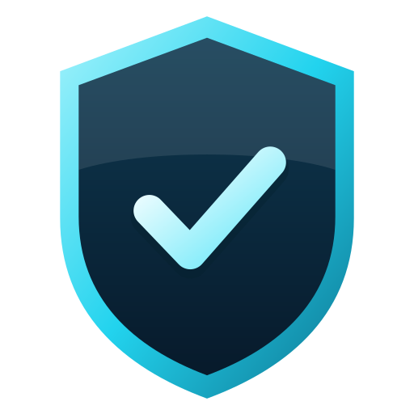
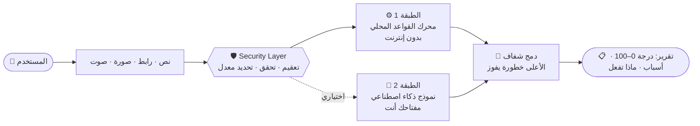

<div align="center">



# TRUST AI &nbsp;·&nbsp; v3.0 «Shield»

### تحقق قبل أن تثق &nbsp;|&nbsp; Verify before you trust

منصة سلامة رقمية تفحص الرسائل والروابط ولقطات الشاشة **قبل** أن تتخذ قراراً خطيراً على الإنترنت — تعمل بدون إنترنت، وبدون حسابات، وبدون أن يغادر نصّك جهازك.
<br/>
*A digital-safety platform that assesses suspicious messages, links and screenshots **before** you make a risky online decision — offline-first, account-free, privacy-first.*

<br/>


**[الميزات](#-الميزات--features) · [الحماية](#-طبقات-الحماية-v30--security-layers) · [البدء السريع](#-البدء-السريع--quick-start) · [الذكاء الاصطناعي](#-تفعيل-الذكاء-الاصطناعي-اختياري--enabling-ai-optional) · [الاختبارات](#-الاختبارات-والتدقيق--tests--audit) · [سجل التغييرات](#-سجل-التغييرات--changelog) · [المطوّر](#-المطوّر--author)**

</div>

---

## 🆕 ما الجديد في v3.0 «Shield» — What's new

> إصدار مخصّص للحماية: **14 طبقة دفاعية**، حارس ضد الإطارات الخادعة، دفاع ضد حقن التعليمات في النماذج، حماية قاعدة الاحتيال من التسميم، تخزين محلي مُتحقَّق، وتدقيق أمني آلي في CI — **بدون حذف أي ميزة سابقة.**
>
> *A security-focused release: **14 defensive layers**, a clickjacking guard, prompt-injection defences for the AI layer, feed-poisoning protection, validated local storage and an automated security audit in CI — **no previous feature removed.***

| | |
|---|---|
| 🛡 **درع الإطارات** | الصفحة مخفية حتى يثبت أنها النافذة العليا → حماية من Clickjacking حتى على GitHub Pages |
| 🔐 **مفتاح API آمن** | يُحفظ على جهازك فقط حتى تلغي التفعيل، يُرسل في **الترويسات لا الروابط**، ويُحجب من كل رسالة خطأ |
| 🧠 **دفاع Prompt Injection** | محارف خفية تُزال، المدخلات تُسيَّج، ودرجة النموذج **لا تستطيع** خفض درجة المحرك المحلي |
| 🖼 **صور موثوقة** | فحص بصمة الملف الحقيقية، رفض SVG/HTML المتنكر، حد أبعاد، وإعادة ترميز تُزيل EXIF |
| 🌐 **قاعدة احتيال محصّنة** | تحقق صارم من النطاقات + قائمة نطاقات محمية + حد حجم + بلا Cookies |
| 📊 **لوحة حالة الحماية** | في «عن المنصة»: فحص ذاتي حيّ لما هو مفعّل **فعلاً** (لا ادّعاءات) |
| ✅ **تدقيق آلي** | `npm run check` = اختبارات + 48 فحصاً أمنياً ساكناً، و CodeQL أسبوعياً |

---

## 🆕 v3.1 — تحديث الميزات

- **تثبيت على سطح المكتب:** زر ظاهر دائماً + شرح خاص بكل متصفح + اختصار ويندوز، وأيقونات PNG (any/maskable) وصورة مشاركة `og-image.png`.
- **أيقونة جديدة** (درع + علامة صح) بكل المقاسات.
- **حكم الأخبار «صادق / كاذب»** بالأدلة: بحث Gemini الحيّ + سجلات ClaimReview، ويُخفَّض الحكم إلى «غير مثبت» عند غياب الدليل.
- **أرقام مشبوهة من الخارج:** قاعدة أنماط ونطاقات موثّقة (لا أرقام أشخاص) + ملف متصل + خطوات الإنقاذ، وتظهر في بحث قاعدة الاحتيال وفي السجل.
- بعد النشر: ضع الرابط المطلق في وسوم `og:image` لتظهر صورة المشاركة في واتساب/تيليغرام.

---

## 🧭 نظرة عامة — Overview



### الهندسة المزدوجة — Dual-layer architecture

| الطبقة | الوضع | المتطلبات |
|--------|-------|-----------|
| **1 — Offline** | محرك قواعد شفاف (Risk Engine) | لا شيء — يعمل بالكامل دون إنترنت |
| **2 — AI Client** | تحسين لغوي + تحليل صور (Vision) اختياري | مفتاح API من مزوّدك (مجاني أو مدفوع) |

> المفاتيح تبقى في **ذاكرة المتصفح فقط** (حقل كلمة مرور). لا تُكتب في أي تخزين، ولا تُرسل إلى أي خادم تابع لـ TRUST AI.

---

## ✨ الميزات — Features

<table>
<tr><td width="50%" valign="top">

### 🔍 التحليل
- **تحليل نص ورابط** بدرجة خطورة شفافة 0–100
- **تفصيل الفئات** بالنقاط والأوزان والنسب
- **فحص الروابط:** نطاقات مشبوهة، انتحال علامات تجارية، عناوين IP، مختصِرات، Punycode
- **رفع لقطة شاشة** — تحليل كامل عند ربط نموذج رؤية
- **«العميل» (Client):** شاشة كاملة تقبل الروابط والصور (حتى 4) والأسماء والأخبار والملفات النصية، مع رسوم بيانية (مقياس، رادار 6 محاور، حلقة فئات، أعمدة خطورة الجمل، مؤشرات المصداقية)
- **تقرير المصدر التفصيلي:** تشريح المصدر، الهوية المُدّعاة مقابل الفعلية، قوس خطورة الجمل

</td><td width="50%" valign="top">

### 🌍 قواعد المعرفة
- **قاعدة احتيال عالمية** بتحديث حيّ من مصادر عامة (Phishunt + GACS)
- **مركز مراقبة احتيال سوريا والشرق الأوسط**
- **ملف أدلة Quest Net / QNet** قائم على الأدلة
- **فاحص أرقام الهواتف المشبوهة** (رموز الدول + أنماط الخطر)
- **مركز مساعدة الضحايا** مع ملاحظات إقليمية
- **نموذج بلاغ محلي** (يُخزَّن على جهازك فقط)

</td></tr>
<tr><td valign="top">

### 🤖 النماذج
- **مجانية** بروابط رسمية: Groq · Google Gemini · OpenRouter
- **مدفوعة:** OpenAI
- **لوحة النماذج:** تبويبات المزوّدين، بطاقات النماذج، إظهار/لصق/تحقق من المفتاح، ونسخ الرابط الرسمي

</td><td valign="top">

### 🎛 التجربة
- **عربي (RTL) + English (LTR)** بتبديل فوري
- **إدخال صوتي** عبر Web Speech API
- **وضع ليلي/نهاري** و**وضع كبار السن**
- **PWA قابل للتثبيت** بأيقونة سطح مكتب وشعار لامع
- **8 أمثلة تجريبية** خيالية للتجربة الآمنة
- واجهة داكنة احترافية للجوال أولاً

</td></tr>
</table>

---

## 🛡 طبقات الحماية v3.0 — Security layers

| # | الطبقة | تمنع |
|:-:|--------|------|
| 1 | **CSP مشدد:** `script-src 'self'` · `script-src-attr 'none'` · `form-action 'none'` · `object-src 'none'` | حقن السكربتات والمعالجات المضمّنة والنماذج المخطوفة |
| 2 | **درع الإطارات** `guard.js` | Clickjacking (حتى بدون ترويسات الخادم) |
| 3 | **ترميز موحّد** `escapeHtml` (يشمل `' ` =`) | XSS / حقن HTML |
| 4 | **`isSafeUrl`** | `javascript:` · `data:` · `file:` · IP داخلية (عشري/سداسي عشري/IPv6) · بيانات دخول في الرابط |
| 5 | **تحقق الصور** (Magic Bytes + رفض SVG + حد أبعاد + إعادة ترميز) | ملفات متنكّرة، قنابل فك الضغط، تسريب EXIF |
| 6 | **حماية مفتاح API** (تحقق · ذاكرة فقط · ترويسات · `redactSecrets`) | حقن CRLF، تسريب المفتاح في السجلات/Referrer |
| 7 | **دفاع Prompt Injection** | رسائل تحاول إقناع النموذج بأنها «آمنة» |
| 8 | **تطبيع مخرجات النموذج** | محتوى ضخم/خبيث من المزوّد |
| 9 | **حماية قاعدة الاحتيال** (تحقق نطاقات + قائمة محمية + حد حجم) | تسميم المصدر والتضخيم |
| 10 | **تخزين محلي مُتحقَّق** | التلاعب بـ localStorage وPrototype Pollution |
| 11 | **Service Worker مقيّد** (قائمة بيضاء + `basic` فقط) | تسميم الكاش |
| 12 | **تحديد المعدل + قفل الطلب الواحد** | الإغراق واستنزاف الحصة |
| 13 | **تدقيق CI:** اختبارات + `audit` + CodeQL + Dependabot | رجوع الثغرات مستقبلاً |
| 14 | **نشر الملفات التشغيلية فقط** | تسرّب الاختبارات والإعدادات |

> ⚠️ **بصراحة:** GitHub Pages لا يرسل ترويسات HTTP مخصصة. للحصول على `frame-ancestors` وHSTS وCOOP الحقيقية استخدم **Cloudflare** أو **Netlify** — الملفان `headers-cloudflare.txt` و`_headers` جاهزان. التفاصيل الكاملة في **[SECURITY.md](SECURITY.md)**. لا يوجد نظام آمن 100%.

---

## 📐 احتساب الخطورة (شفاف) — Risk scoring

| الفئة / Category | الحد الأقصى / Max |
|------------------|:----------------:|
| الاستعجال والضغط · Urgency / pressure | 15 |
| انتحال الهوية · Impersonation | 20 |
| طلب أموال · Money request | 20 |
| طلب معلومات حساسة · Sensitive info | 20 |
| مؤشرات الرابط · Link indicators | 15 |
| عروض غير واقعية · Unrealistic offers | 5 |
| هندسة اجتماعية · Social engineering | 5 |

| الدرجة / Score | المستوى / Level |
|:--------------:|-----------------|
| 0–24 | 🟢 منخفض · Low risk |
| 25–49 | 🟡 متوسط · Medium risk |
| 50–74 | 🟠 مرتفع · High risk |
| 75–100 | 🔴 شديد · Severe risk |
| n/a | ⚪ يحتاج تحقق إضافي · Needs further verification |

**مهم:** النتائج تقييم مخاطر وليست أحكاماً مطلقة. لا يستطيع أي نظام ضمان سلامة 100%.
*Important: results are risk assessments, not absolute verdicts.*

---

## 🚀 البدء السريع — Quick start

لا حاجة لخطوة بناء ولا لأي اعتمادات:

```bash
git clone https://github.com/danial56hd-wq/TRUST-AI.git
cd TRUST-AI

npx serve .                    # أو / or
python3 -m http.server 8080
```

افتح `http://localhost:8080` — أو انشره مباشرة على **GitHub Pages** (Settings → Pages → Source = *GitHub Actions*؛ ملف `deploy.yml` جاهز ويشغّل الاختبارات قبل النشر).

> يتطلب Node.js 18+ للاختبارات فقط. التطبيق نفسه ملفات ساكنة.

---

## 🤖 تفعيل الذكاء الاصطناعي (اختياري) — Enabling AI (optional)

1. افتح **الإعدادات / لوحة النماذج** (أيقونة الترس)
2. اختر نموذجاً مجانياً (مثل Groq أو Gemini Flash)
3. أنشئ مفتاحاً من الرابط الرسمي الظاهر في القائمة
4. الصق المفتاح (حقل كلمة مرور، للجلسة فقط)
5. اضغط **حفظ وتفعيل** ثم **اختبار الاتصال**

| المزوّد | رابط المفتاح الرسمي | ملاحظات |
|---------|---------------------|---------|
| **Groq** | https://console.groq.com/keys | Llama 3.3 · Mixtral · نماذج مجانية |
| **Google AI Studio** | https://aistudio.google.com/apikey | Gemini 1.5 Flash / Pro — يدعم الرؤية |
| **OpenRouter** | https://openrouter.ai/keys | نماذج مجانية متعددة |
| **OpenAI** | https://platform.openai.com/api-keys | GPT-4o / GPT-4o mini (مدفوع) |

> 🔒 **أمان المفتاح (v3):** يُتحقَّق من صيغته، يُحفظ على جهازك فقط (بعد نجاح الاتصال) حتى تلغي التفعيل، يُرسل في ترويسة HTTP (وليس في الرابط)، وتُحجب أي نسخة منه من رسائل الأخطاء.

---

## 🧪 الاختبارات والتدقيق — Tests & audit

```bash
npm test         # 140+ اختباراً: محرك المخاطر · محرك العميل · طبقة الأمان
npm run audit    # 48 فحصاً أمنياً ساكناً (CSP · eval · أسرار · روابط · SW · ترجمات)
npm run check    # الاثنان معاً — وهو ما يشغّله CI قبل كل نشر
```

يغطي التدقيق: صرامة CSP وتطابقها مع ترويسات الخادم، غياب `eval` والسكربتات المضمّنة، غياب مفاتيح مكتوبة في الشيفرة، عدم تخزين المفتاح أو وضعه في رابط، `rel="noopener"` لكل رابط خارجي، سلامة قائمة الكاش، وتطابق مفاتيح الترجمة بين العربية والإنجليزية.

---

## 🗂 هيكل المشروع — Project structure

```
TRUST-AI/
├── index.html                 # الواجهة + CSP
├── manifest.json              # PWA
├── sw.js                      # Service Worker مقيّد (قائمة بيضاء)
├── _headers                   # ترويسات حقيقية (Netlify / Cloudflare Pages)
├── headers-cloudflare.txt     # نفس الترويسات لـ Cloudflare Transform Rules
├── css/styles.css
├── assets/                    # logo · icon · icon-192 · icon-512
├── js/
│   ├── guard.js               # 🆕 درع الإطارات (Clickjacking)
│   ├── security.js            # 🆕 v3 — الطبقة الأمنية المركزية
│   ├── shield-ui.js           # 🆕 لوحة حالة الحماية الحيّة
│   ├── app.js                 # المتحكم الرئيسي + الصوت + عن المنصة
│   ├── risk-engine.js         # محرك القواعد (بدون إنترنت)
│   ├── ai-provider.js         # طبقة الذكاء الاصطناعي (مُحصَّنة)
│   ├── client.js · client-engine.js · client-data.js   # «العميل»
│   ├── source-report.js       # تقرير المصدر
│   ├── fraud-db.js            # قاعدة الاحتيال العالمية (مُحصَّنة)
│   ├── phone-check.js · questnet.js · victim-help.js
│   ├── i18n.js · examples.js · sw-register.js
├── tests/                     # risk-engine · client-engine · security
├── scripts/
│   ├── audit.mjs              # 🆕 التدقيق الأمني الساكن
│   └── bundle-single-file.mjs # 🆕 حزم التطبيق في ملف HTML واحد للمعاينة
├── .github/
│   ├── workflows/deploy.yml   # اختبار ← نشر (الملفات التشغيلية فقط)
│   ├── workflows/security.yml # audit + CodeQL أسبوعي
│   ├── dependabot.yml · CODEOWNERS
├── .well-known/security.txt   # 🆕 جهة الإبلاغ عن الثغرات
├── SECURITY.md · LICENSE · .env.example · package.json
```

---

## 🔏 الخصوصية — Privacy

- لا حسابات مستخدمين
- لا تخزين دائم لمحتوى الرسائل أو الصور أو كلمات المرور أو OTP أو البيانات البنكية
- مفاتيح API تُحفظ على جهازك فقط وتُمسح عند إلغاء التفعيل يدويًا
- معاينات الصور المؤقتة تُحرَّر من الذاكرة عند إزالتها، والصور تُعاد ترميزها (تُزال بيانات EXIF/الموقع)
- لا تحليلات تجمع محتوى الرسائل — ولا أي «Beacon» خارجي
- السجل والبلاغات محلية على جهازك، ويمكن مسحها في أي وقت

---

## 📜 سجل التغييرات — Changelog

<details open>
<summary><b>v3.0 «Shield»</b> — تحصين أمني شامل</summary>

- 14 طبقة حماية (انظر الجدول أعلاه) + وحدة `security.js` v3 + `guard.js` + `shield-ui.js`
- CSP أشد: `script-src-attr 'none'` و`form-action 'none'`؛ إزالة وسوم `<meta>` غير الفعّالة
- مفتاح Gemini انتقل من الرابط إلى ترويسة `x-goog-api-key`
- Service Worker بقائمة بيضاء، والكاش `trust-ai-v3.0`
- تحقق صارم من تخزين السجل والعدّاد والبلاغات وقاعدة الاحتيال
- ملفات جديدة: `_headers`، `LICENSE`، `.well-known/security.txt`، `CODEOWNERS`، `dependabot.yml`، `security.yml`، `audit.mjs`، `security.test.js`
- `deploy.yml` يشغّل الاختبارات أولاً وينشر الملفات التشغيلية فقط
</details>

<details>
<summary><b>v2.1</b> — إصلاحات التدقيق</summary>

- إدخال الصورة وحدها لم يعد يُظهر «خطر منخفض» بل «يحتاج تحقق إضافي» (المحرك + التطبيق)
- إصلاح كتلة عربية في غير مكانها في `i18n.js` (46 نصاً من v2 تصل الآن للواجهة العربية؛ 260/260 مفتاحاً في اللغتين)
- نقل تسجيل Service Worker إلى `js/sw-register.js` (السكربت المضمّن كان محجوباً بالـ CSP)
- إزالة `frame-ancestors` / `X-Frame-Options` من `<meta>` (تتجاهلها المتصفحات)، وإتاحة الميكروفون `microphone=(self)`
- تحصين محلّل التغذية الحيّة (إدخالات معطوبة، روابط بلا بروتوكول) وتهريب الحقول القادمة من الذكاء الاصطناعي
- عبارات استعجال/جوائز إضافية في محرك المخاطر + اختبارات انحدار؛ إضافة `package.json`
</details>

<details>
<summary><b>v2.0</b> — الأمان وقواعد المعرفة</summary>

- **تحصين أمني:** `js/security.js` المركزي، CSP أشد، تحديد المعدل، فحص روابط أأمن
- **قاعدة احتيال عالمية** بتحديث حيّ (Phishunt + GACS)
- مركز مراقبة احتيال **سوريا والشرق الأوسط**
- ملف أدلة **Quest Net / QNet**
- **فاحص أرقام الهواتف المشبوهة**
- **مركز مساعدة الضحايا** مع ملاحظات إقليمية
- **نموذج بلاغ محلي** (تخزين على الجهاز فقط)
- لم تُحذف أي ميزة من v1.x
</details>

<details>
<summary><b>v1.6</b> — «العميل» ولوحة النماذج</summary>

- **العميل (Client):** شاشة كاملة لتحليل الحدث تقبل الروابط والصور (حتى 4) والأسماء والأخبار والرسائل والملفات النصية، وتعرض الحكم والمقياس، شرح الحدث ونوعه وكيف يعمل، التحذيرات مرتبة بالخطورة، رسوماً بيانية (مقياس، رادار 6 محاور، حلقة حصص الفئات، أعمدة خطورة كل جملة، مستويات المحاور، مؤشرات المصداقية)، العناصر المستخرجة، فحص الروابط، الادعاءات، أدوات تحقق رسمية، وما يجب فعله وتجنبه
- **لوحة النماذج** تحل محل نافذة الإعدادات: تبويبات المزوّدين، بطاقات النماذج، خانة المفتاح (إظهار/لصق/تحقق من الصيغة) والرابط الرسمي لإنشاء المفتاح مع نسخه
- ملفات جديدة: `js/client.js` (الواجهة)، `js/client-engine.js` (محرك محلي نقي)، `js/client-data.js` (الأدلة والنصوص)، `tests/client-engine.test.js`
- لم تُحذف أي ميزة سابقة (التحليل الأساسي، التقرير التفصيلي، الصوت، السجل، الوضع الليلي/كبار السن، PWA…)
</details>

<details>
<summary><b>v1.1</b> — الأساس</summary>

- صفحة شرح موثوق للمنهجية (About) — طبقات التحليل، الأوزان، الخصوصية والحدود
- شعار أنيق لامع + أيقونة سطح المكتب عند التثبيت (PWA manifest)
- تواصل مع المطوّر عبر البريد: **nidalwatfa99@gmail.com**
- إدخال صوتي (ميكروفون) عبر Web Speech API
</details>

---

## 🤝 المساهمة — Contributing

المساهمات مرحّب بها! قبل أي Pull Request شغّل:

```bash
npm run check
```

- لا تضف `eval` أو `new Function` أو `innerHTML` بمحتوى غير مُهرَّب (التدقيق سيفشل).
- مصدر خارجي جديد؟ حدّث `connect-src` في `index.html` و`headers-cloudflare.txt` و`_headers`.
- للإبلاغ عن ثغرة: **لا تفتح Issue علنياً** — راجع [SECURITY.md](SECURITY.md).

---

## 👨‍💻 المطوّر — Author

**نضال وطفة · Nidal Watfa**

<p>
  <a href="https://github.com/danial56hd-wq"></a>
  <a href="https://codeberg.org/nidalwatfa"></a>
  <a href="https://t.me/nidal12watfa"></a>
  <a href="https://x.com/NidalWatfa12501"></a>
  <a href="https://www.linkedin.com/in/nidal-watfa-a91720301"></a>
  <a href="https://orcid.org/0009-0003-2462-6630"></a>
  <a href="mailto:nidalwatfa99@gmail.com?subject=TRUST%20AI%20Feedback"></a>
</p>

للملاحظات والاقتراحات والإبلاغ عن مشكلة: **nidalwatfa99@gmail.com**

---

## 📄 الترخيص — License

مرخّص بموجب **[MIT](LICENSE)** © 2026 Nidal Watfa — أساس مفتوح للثقة والسلامة الرقمية.

<div align="center">

**TRUST AI** — رفيق هادئ وموثوق يساعدك على التوقف لحظة قبل قرار رقمي قد يسبب لك ضرراً.
<br/>
*A calm, reliable companion that helps you pause before a digital decision that could cause harm.*

⭐ إن أعجبك المشروع فلا تنسَ منحه نجمة · *If you like it, give it a star*

</div>
